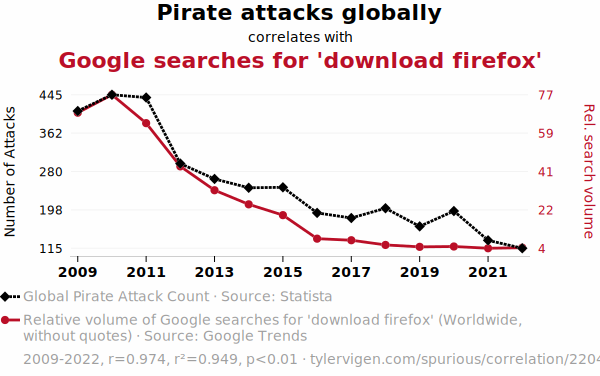
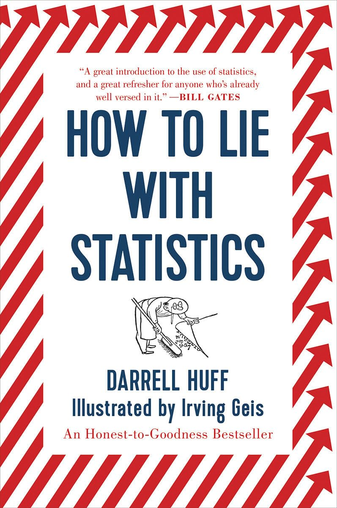
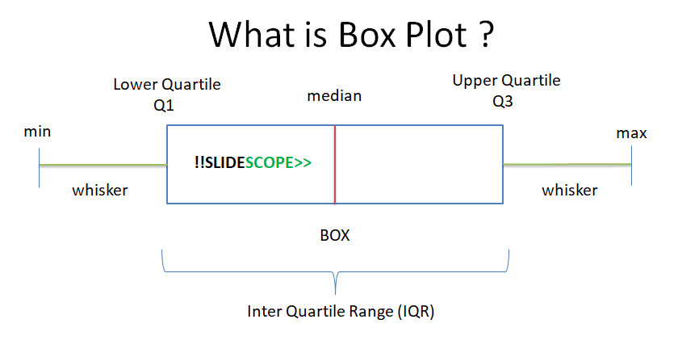

# Week 6 Class Material 

Ethics in data visualization play a crucial role in how information is presented and interpreted. With the increasing reliance on data visualizations to inform decisions, share insights, and convey complex information, the ethical considerations become paramount. These include the responsibility to accurately represent data, avoid misleading representations, and ensure that visualizations are accessible and understandable to a broad audience. Ethical data visualization practices not only foster trust and credibility but also ensure that the data's story is told in a fair and accurate manner, respecting the data's integrity and the audience's ability to make informed judgments.

Next we  will explore a series of examples that highlight unethical or misleading practices in visual data representation. These examples serve as cautionary tales, underscoring the potential for visualizations to distort reality, mislead audiences, or misrepresent data—whether intentionally or inadvertently. From manipulating axes to selectively showcasing data, these practices can significantly impact the viewer's perception and understanding. By examining these examples, we aim to illustrate the importance of adhering to ethical standards in data visualization, emphasizing the need for transparency, accuracy, and clarity to uphold the integrity of the data being presented.

###### 1. Bad visualizations

News media has historically produced its fair share of misleading data visualizations. As the importance of data visualization gains recognition, the frequency of such errors appears to be on the decline. Nonetheless, vigilant observers can still spot significant mistakes in the data visualizations presented by news outlets. For example,

- [WTF Visualizations](http://viz.wtf/)
- [The most misleading charts of 2015, fixed](http://qz.com/580859/the-most-misleading-charts-of-2015-fixed/)
- [Flowing data: Ugly visualization](http://flowingdata.com/category/visualization/ugly-visualization/)
- [Unemployment rate under president Obama](http://flowingdata.com/2011/12/12/fox-news-still-makes-awesome-charts/)
- [Zika virus](https://twitter.com/NickatFP/status/765035980759797760/photo/1)
1. [Shut up about the y-axis. It shouldn’t always start at zero](https://www.youtube.com/watch?v=14VYnFhBKcY)

######  2. Correlation != causation

- [Spurious correlations](http://www.tylervigen.com/spurious-correlations)
- [Correlation or Causation?](http://www.bloomberg.com/bw/magazine/correlation-or-causation-12012011-gfx.html)
- [How to Lie with Statistics](http://www.amazon.com/How-Lie-Statistics-Darrell-Huff/dp/0393310728)

The book delves into the intriguing concept of shaping perception through the strategic selection of the vertical axis's range, specifically by avoiding the default of starting at zero. However, this approach shouldn't be adhered to as an unbreakable rule. For a more nuanced understanding of this topic, the Vox video titled "Shut up about the y-axis. It shouldn’t always start at zero" offers a compelling explanation that highlights why this is the case.

---------
### Python Coding 
Druing week 6 in class, we'll tackle the challenge of visualizing multiple distributions at once, like temperature variations across months. We'll move beyond traditional methods to explore techniques such as boxplots, violin plots, and ridgeline plots, ideal for these scenarios. We'll focus on how to use response and grouping variables effectively, providing a clear view of distinct distributions. This will equip you with advanced strategies for presenting complex data in a coherent and insightful manner. For practical application, here we have the Python code that demonstrates all of these plots (box plots, violin plots, and ridgeline plots): https://github.com/Reben80/Data110-32213/blob/main/Week6.ipynb.

#### What is Box Plot?

### Week 7 Reading Assignment

| Week | Chapter | Topics  |
|------|---------|----------------|
| 7 | ***Chapter  4 Color scales*** | Chapter 6 delves into the strategic use of color in data visualizations, covering three core applications: distinguishing data groups, representing data values, and highlighting key information, each requiring distinct color choices and applications. |
| 7 |  ***Runestone Chapter 4***: Python and Jupyter Notebooks | Review the fundamental constructs of programming in Python. Learn to use a type of programming notebook that mixes text and code.|

